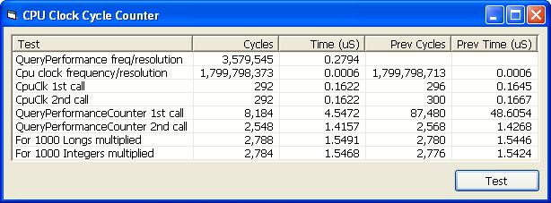



## Read the cpu clock cycle count for sub\-microsecond timing\. VB\+ASM \(Updated 07/05\)

### Description

Pentium class cpu's include a 64 bit register that increments from power-on at the CPU clock frequency. With a 2GHz processor, you have in effect, a 2GHz clock. The cCpuClk class allows the user to retrieve the 64 bit CPU clock cycle count into a passed currency parameter. The class can be used as a basis for sub-microsecond benchmarking and delay timing. Note that with the extreme resolution provided, multitasking and the state of the cpu caches will show in the results. Thanks to David Fritts and Robert Rayment for the vtable trick.

Update 7/1/2003 - I said... at this resolution cache FX come into play. In determining the call overhead, I should have born that in mind. Just goes to show you have to be extra, extra careful with benchmarks.

Update 7/5/2003 - I got asked to do an article for a benchmark site based on this submission so I thought I'd put a little more effort into the data displayed. See new screenshot.
 
### More Info
 

             |
---                |---
**Submitted On**   |2003-07-02 10:39:40
**By**             |[Paul Caton](https://github.com/Planet-Source-Code/PSCIndex/blob/master/ByAuthor/paul-caton.md)
**Level**          |Intermediate
**User Rating**    |5.0 (80 globes from 16 users)
**Compatibility**  |VB 5\.0, VB 6\.0
**Category**       |[Miscellaneous](https://github.com/Planet-Source-Code/PSCIndex/blob/master/ByCategory/miscellaneous__1-1.md)
**World**          |[Visual Basic](https://github.com/Planet-Source-Code/PSCIndex/blob/master/ByWorld/visual-basic.md)
**Archive File**   |[Read\_the\_c161017752003\.zip](https://github.com/Planet-Source-Code/paul-caton-read-the-cpu-clock-cycle-count-for-sub-microsecond-timing-vb-asm-updated-07-05__1-46555/archive/master.zip)

